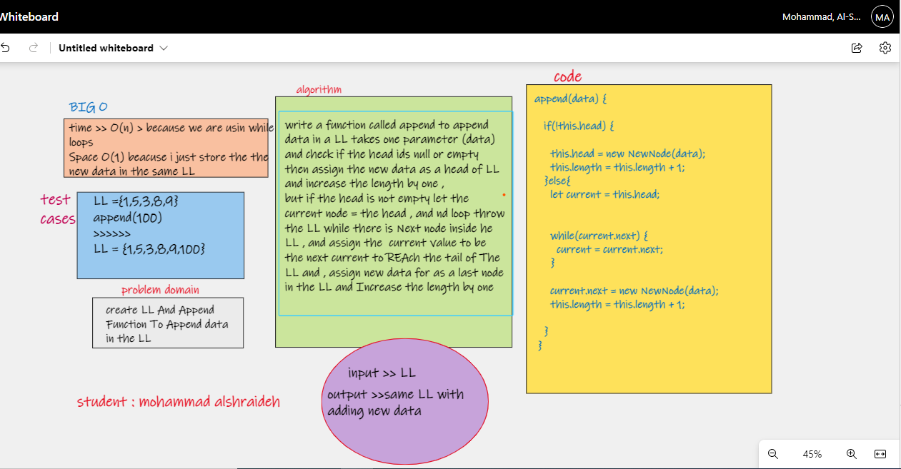
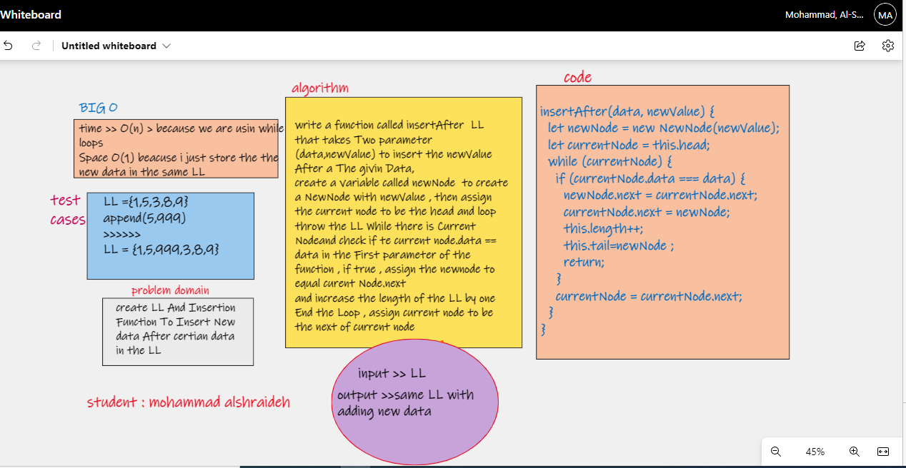

# linked-list-insertions

[LinkedList.js file](linkedlist.md)

[node js](./NewNode.js)

## white process
append WhiteBoard :

insertAfter :

## Challenge
Write the following methods for the Linked List class:

`append`
arguments: new value
adds a new node with the given value to the end of the list

`insert before`
arguments: value, new value
adds a new node with the given new value immediately before the first node that has the value specified

`insert after`
arguments: value, new value
adds a new node with the given new value immediately after the first node that has the value specified

## Approach & Efficiency
i tried to make the Big O as lowest as i can by using while loop
and making my code shorter as i could

Big O for time = O(n) for all methods
Big O for space = O(1) for all methods

[back to challenge README file ](../../README.md)

# summary

A linked list is a way to store a collection of elements. Like an array these can be character or integers. Each element in a linked list is stored in the form of a node.
A node is a collection of two sub-elements or parts. A data part that stores the element and a next part that stores the link to the next node.
A linked list is formed when many such nodes are linked together to form a chain. Each node points to the next node present in the order. The first node is always used as a reference to traverse the list and is called HEAD. The last node points to NULL.
