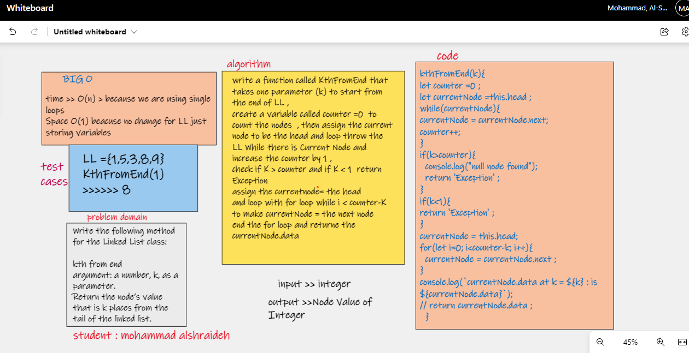
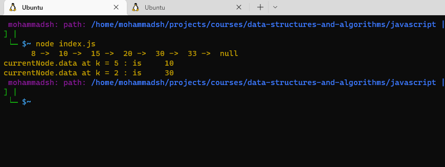

# Kth from End LL

[LinkedList.js file](linkedList.js)

[node js](node.js)


## white process
 WhiteBoard :
 


## Challenge
Write a method for the Linked List to return the node at K index starting from the tail of the list  : KthFromEnd(K):

code :
```js
 kthFromEnd(k){
let counter =0 ;
let currentNode =this.head ;
while(currentNode){
currentNode = currentNode.next;
counter++;
}
if(k>counter){
  console.log("null node found");
  return 'Exception' ;
}
if(k<1){
return 'Exception' ;
}
currentNode = this.head;
for(let i=0; i<counter-k; i++){
  currentNode = currentNode.next ;
}
console.log(`currentNode.data at k = ${k} : is     ${currentNode.data}`);
// return currentNode.data ;
  }
```
## Approach & Efficiency

Big O for time = O(n)because of the use of the for loop
Big O for space = O(1)


[back to challenge README file ](../../README.md)

### results || test



