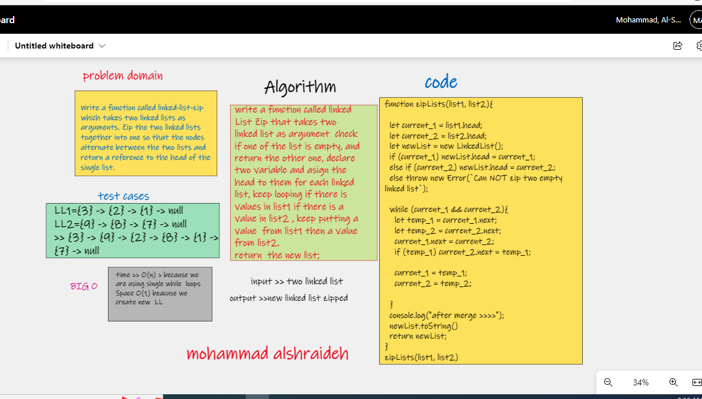
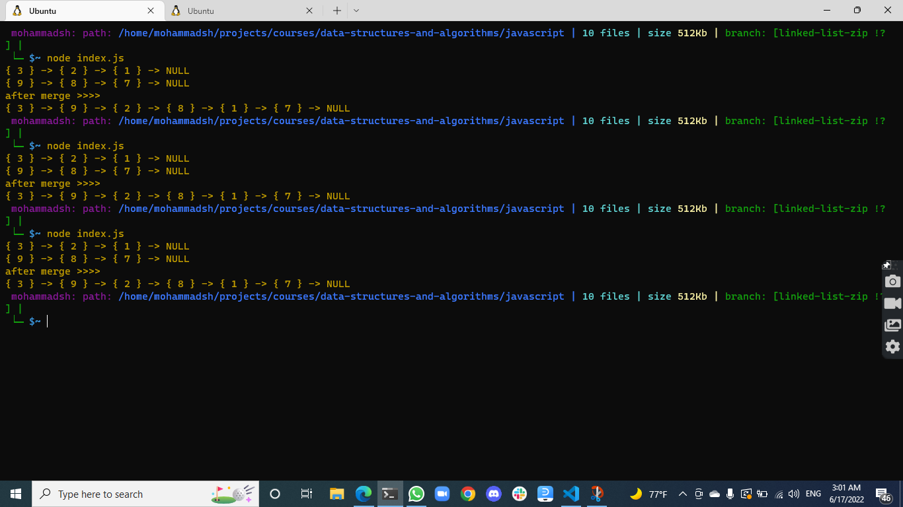

# Zip-Linked-lists

[zipLinkedList.js](ZipLinkedList.js)

[zip.test.j](../../__test__/zip.test.js)

Code Challenge / Algorithm 

Write a function called zip lists
Arguments: 2 linked lists
Zip the two linked lists together into one so that the nodes alternate between the two lists and 
Return: New Linked List.

## whiteboard 


## result 

## Challenge
 
my code :

```js
function zipLists(list1, list2){

  let current_1 = list1.head;
  let current_2 = list2.head;
  let newList = new LinkedList();
  if (current_1) newList.head = current_1;
  else if (current_2) newList.head = current_2;
  else throw new Error(`Can NOT zip two empty linked list`);

  while (current_1 && current_2){
    let temp_1 = current_1.next;
    let temp_2 = current_2.next;
    current_1.next = current_2;
    if (temp_1) current_2.next = temp_1;

    current_1 = temp_1;
    current_2 = temp_2;

  }
  console.log("after merge >>>>");
  newList.toString()
  return newList;
}
zipLists(list1, list2)
```

## Approach & Efficiency and BIG O
i tried to make the Big O as lowest as i can by using while loop 

time >> O(n)
space >>O(1)

[back to challenge README file ](../../README.md)


