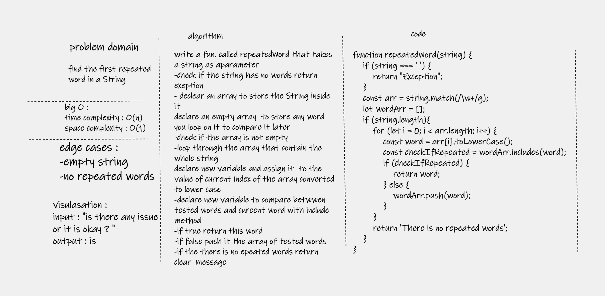

# hashmap-repeated-word

## challenge Summary

-Find the first repeated word in a book. :

Write a function called repeated word that finds the first word to occur more than once in a string
Arguments: string
Return: string

## white board



## big O


time complexity : O(n)

space complexity : O(1)

## code
find code [here](repeatedWord.js)
```js
function repeatedWord(string) {
    if (string === ' ') {
        return "Exception";
    }
    const arr = string.match(/\w+/g);
    let wordArr = [];
    if (string.length){
        for (let i = 0; i < arr.length; i++) {
            const word = arr[i].toLowerCase();
            const checkIfRepeated = wordArr.includes(word);
            if (checkIfRepeated) {
                return word;
            } else {
                wordArr.push(word);
            }
        }
        return 'There is no repeated words';
    }
}
```

### test

`npm test repeatedWord`

test file [here](__test__/repeatedWord.test.js)

