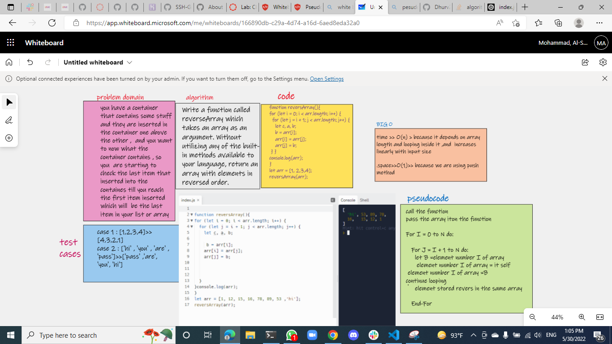

[array-reverse md file ](./array-resvers.md)

[array-insert-shift md file ](./array-insert-shift.md)


 ```js
function reversArray(){
for (let i = 0; i < arr.length; i++) {
  for (let j = i + 1; j < arr.length; j++) {
    let c, a, b;

     b = arr[i];
    arr[i] = arr[j];
    arr[j] = b;


  }
}console.log(arr);
}
let arr = [1, 12, 15, 16, 78, 89, 53 ,'hi'];
reversArray(arr);

 ```

## Whiteboard Process



## Approach & Efficiency

i used a  simple (for loop) to revers the array with push method  becuase i am so familiar with it and suit for the problem , and the Big O time is O(n) and / Space is O(1)

.
 [ back toread me file in code challenge](../javascript/code-challenges/README.md)

