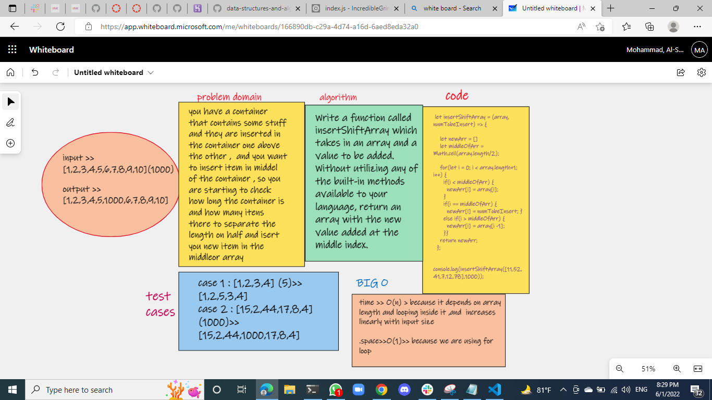

# Reverse an Array

 i made a function called insertShiftArray which takes an array and a number as an argument, return an array with the number is added to the middle of the array  .

 ```js
let insertShiftArray = (array, numTobeInsert) => {

    let newArr = []
    let middleOfArr = Math.ceil(array.length/2);

    for(let i = 0; i < array.length+1; i++) {
      if(i < middleOfArr) {
        newArr[i] = array[i];
      }
      if(i == middleOfArr) {
        newArr[i] = numTobeInsert; }
      else if(i > middleOfArr) {
        newArr[i] = array[i -1];
      }}
    return newArr;
  };

  console.log(insertShiftArray([11,52,41,7,12,78],1000));


 ```

## Whiteboard Process



## Approach & Efficiency

i used a  simple (for loop) to loop throw the array and check the middle of array length to insert the number i nwant after it .   and the Big O time is O(n) and / Space is O(1)

.
  [back to challenge README file](../README.md)
