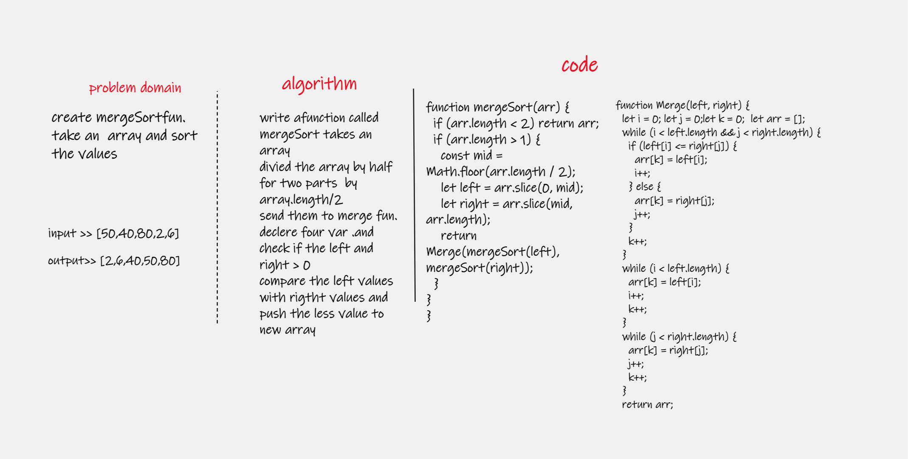
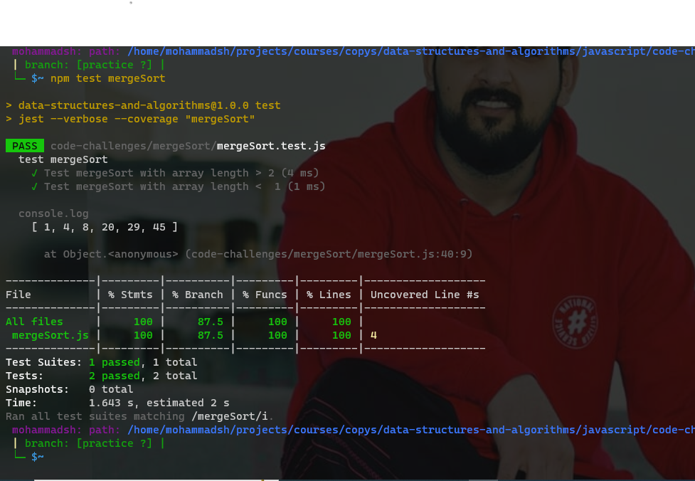

# merge Sort

## Challenge Summary
Trace the algorithm by stepping through the process with the provided sample array. Document your explanation by creating a blog article that shows the step-by-step output after each iteration through some sort of visual.

Once you are done with your article, code a working, tested implementation of Merge Sort

## whiteboard

## Approach & Efficiency
Time Complexity: O(nlog(n))
Space Complexity: O(n)

## test
`npm test mergeSort`

## code

[code here](./mergeSort.js)

####
main README [here](../README.md)
