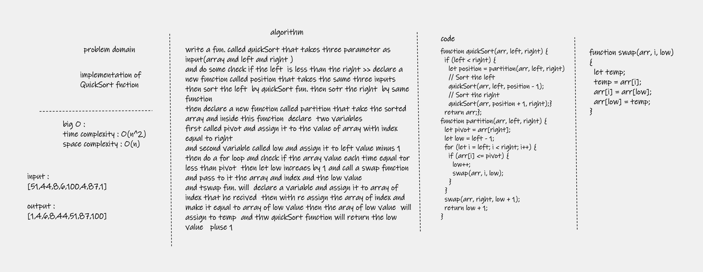
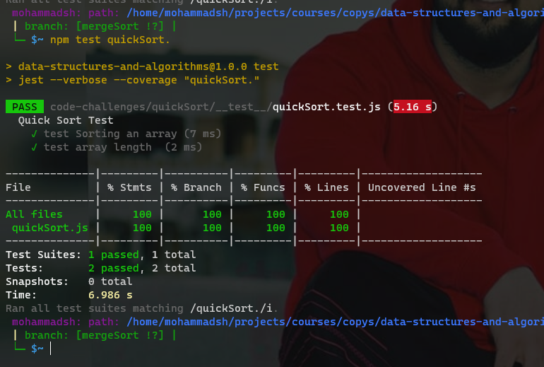

# quick Sort

## Challenge Summary
Quicksort is a divide-and-conquer algorithm. It works by selecting a 'pivot' element from the array and partitioning the other elements into two sub-arrays, according to whether they are less than or greater than the pivot. For this reason, it is sometimes called partition-exchange sort.The sub-arrays are then sorted recursively. This can be done in-place, requiring small additional amounts of memory to perform the sorting.

## Challenge Description
Review the pseudo code, then trace the algorithm by stepping through the process with the provided sample array. Document your explanation by creating a blog article that shows the step-by-step output after each iteration through some sort of visual.

## approach
Big O
Time: O(n^2) Space: O(n)
## whiteboard

## test
`npm test quickSort`
[test file](./__test__/quickSort.test.js)

## code
[code here ](quickSort.js)
