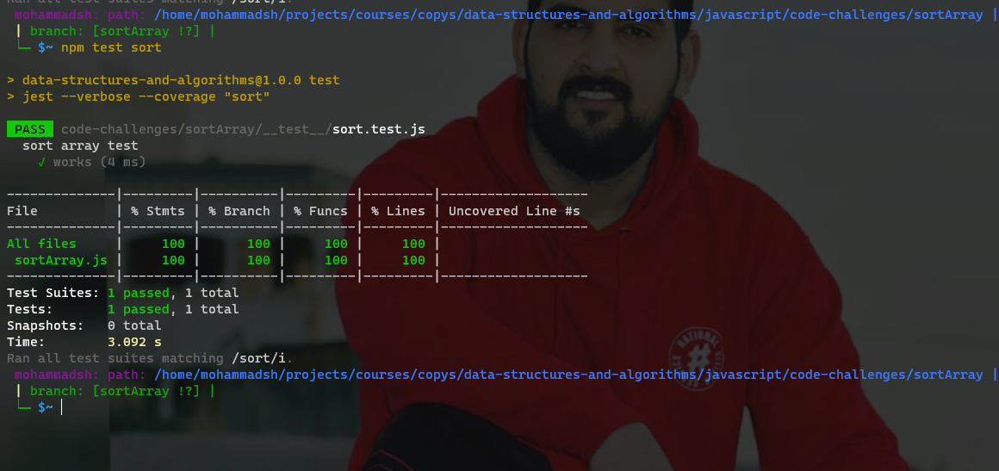

# Insertion Sort

## Challenge Summary
Insertion sort is a simple sorting algorithm that works similar to the way you sort playing cards in your hands. The array is virtually split into a sorted and an unsorted part. Values from the unsorted part are picked and placed at the correct position in the sorted part.

## whiteboard

Big O
Time: O(n2)
Space: O(1)

## test
`npm test sort`

## code

[code here](./sortArray.js)

####
main README [here](../README.md)
