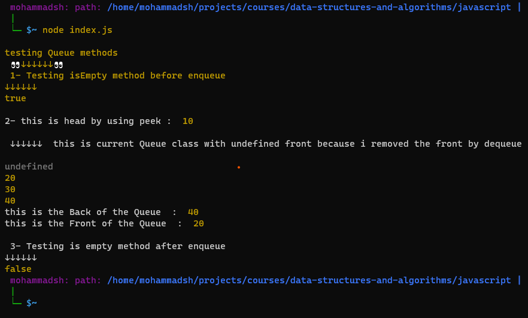
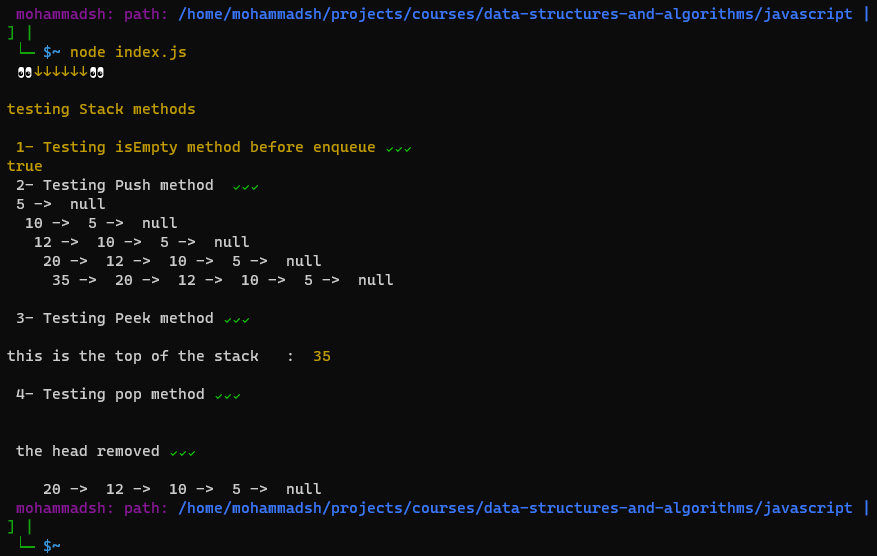
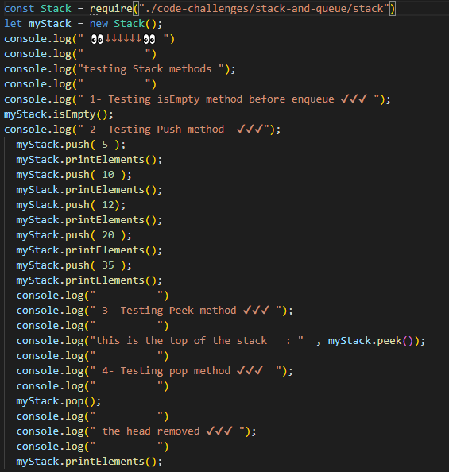
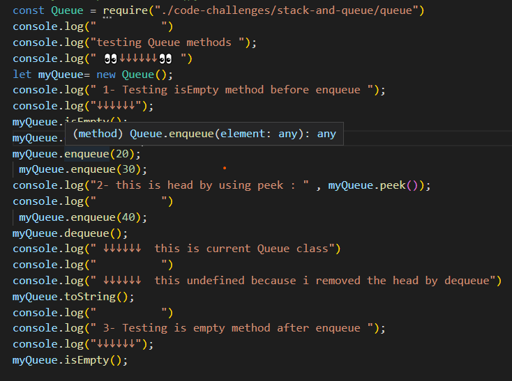

# Stacks and Queues

### my doc : [Live URL](https://mohammadsh96.github.io/reading-notes/StacksAndQueues.html)

### my code :
▶ [Stack Class](./stack.js) ◀

▶[Queue Class](queue.js)◀

▶[test file](./Stack-Queue.test.js)◀

 ## testing :

 - queue test:

 note : if you like it Comment with "wow"

- Stack test :

- how i test them on index.js:

## Challenge

 implement both a Stack and a Queue

 - push , pop ,peek , isEmpty : `for Stack`

- enqueue . dequeue , peek , isEmpty : `for Queue`

## Approach & Efficiency

using If statement to check  and  re-assigning properties
 so the Big O is  = O(1) for all methods

[◀ back to CodeChallenge README ](../README.md)
