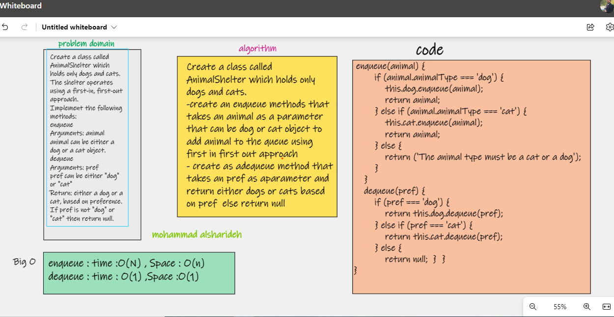
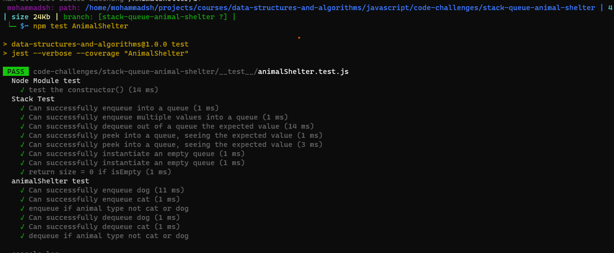

 ## Challenge AnimalShelter Summary

[main REAdME](../README.md)

 code : [ is here](./AnimalShelter.js)

 test : [is here](./__test__/animalShelter.test.js)

- Create a class called `AnimalShelter` which holds only `dogs` and `cats`.
The shelter operates using a first-in, first-out approach.

- Methods:

- `enqueue`  :
Arguments: `animal` <> can be either a dog or a cat object.
- `dequeue`:
Arguments: `pref` <> `Extracts` can be either "dog" or "cat"
Return: either a dog or a cat, based on preference.
If pref is not "dog" or "cat" then return null.

## Whiteboard Process

### test

### Approach & Efficiency

understood the problem first
I imagined how the results should be
I wrote the code
make a constructor that creates a new array for each shelter
create a class "animal" with a constructor that handles the types of animals
write and enqueue method that creates a new animal and pushes it into the shelter
write a dequeue method that removes the first animal of specified pref
I made the tests

### big O

enqueue(value) time : o(n) , space O(n)

dequeue() time : o(1) , space O(1)

### API
enqueue(animal) : add object into the AnimalShelter, using a first-in  first-out approach

dequeue(pref) : Removes the object from the front of the AnimalShelter
