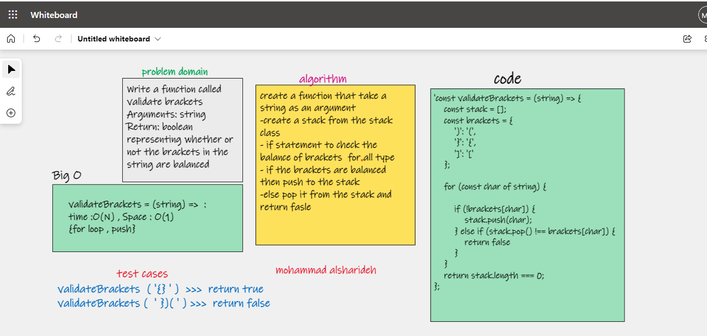

# stack-queue-brackets

### Challenge Summary

- Your function should take a string as its only argument, and should return a boolean representing whether or not the brackets in the string are balanced.

- There are 3 types of brackets
Round Brackets : ()
Square Brackets : []
Curly Brackets : {}

## Whiteboard Process

## Approach & Efficiency

BIG O >>  time : o(n) , space O(1)

because i used  for loop that depends on the satck length and for the space using push or pop method is always O(1)

## API
validateBrackets(str) : check whether or not the brackets in the string are balanced

## code :

[stack-bracket.js](./stack-bracket.js)

[bracket.test](./__test__/bracket.test.js)

