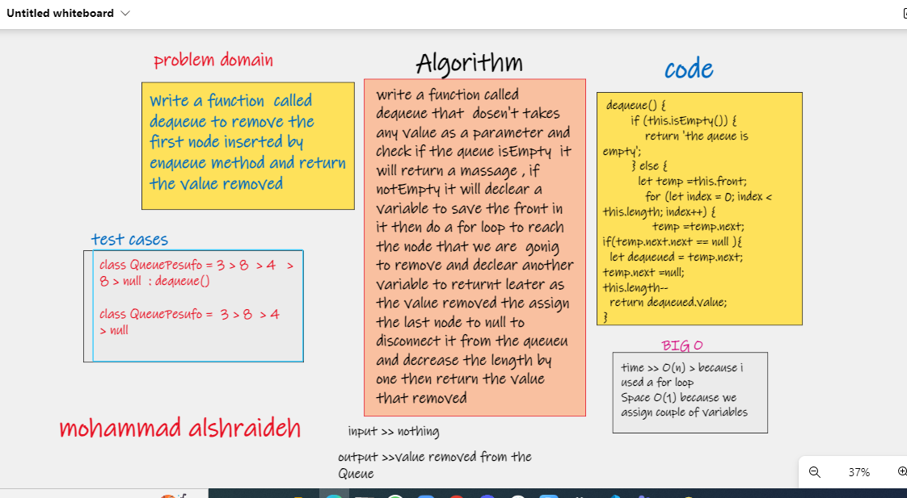

# Challenge Summary
[main REAdME](../README.md)

 code : [ is here](./pseudoQueue.js)

 test : [is here](./__test__/stack-queue-pesudo.test.js)

- Create a new `class` called pseudo queue.
Do not use an existing Queue.
Instead, this `PseudoQueue` class will implement our standard queue interface .

- Methods:

- `enqueue`  :
Arguments: `value` <> `Inserts` value into the PseudoQueue
- `dequeue`:
Arguments: `none` <> `Extracts` a value from the PseudoQueue

## Whiteboard Process

for enqueue

for dequeue

## Approach & Efficiency

*bigO*

- time >> O(1) > because we are using if statement only,
Space O(1) because we add a value to queue.
## Solution

 " node index.js " on path : /home/mohammadsh/projects/courses/data-structures-and-algorithms/javascript/code-challenges/stack-queue-pseudo

