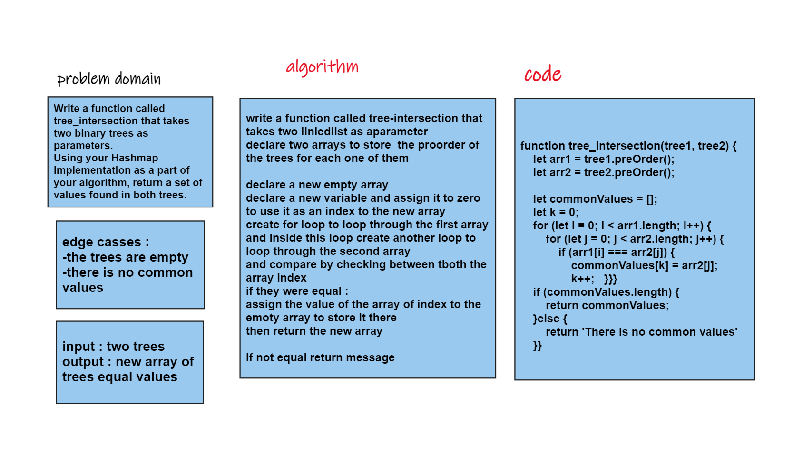

#

## challenge summary 

Write a function called tree_intersection that takes two binary trees as parameters.
Using your Hashmap implementation as a part of your algorithm, return a set of values found in both trees.

## white Board

## approach and API

time complexity = O(n^2) 
space complexity = O(n)
## test

`npm test tree-intersection`

test file [here](./__test__/tree-intersection.test.js)

## code
code file [here](tree-intersection.js)