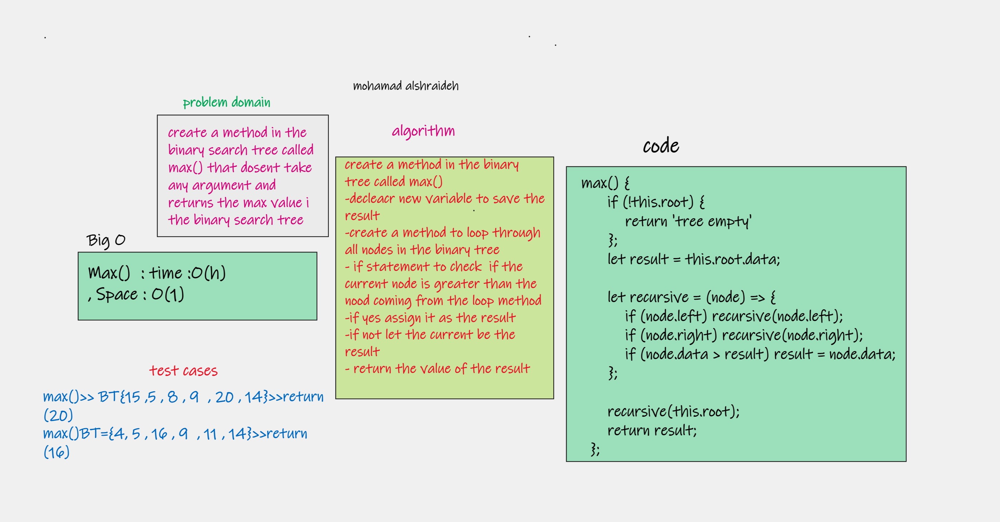

# Challenge Summary

a method to Find the maximum value stored in the tree

## Whiteboard Process


## Approach & Efficiency

i use a method inside the max metgod to loop through the tree that will make the  Big O time complexity = O(h) and the space complexity = O(1)
## Solution

link to code [here](./binary-tree.js)


link to test [here](../BinaryTree/__test__/Binary-tree.test.js)

to run test >>> `npm test Binary-tree`
```js

max() {
      if (!this.root) {
          return 'tree empty'
      };
      let result = this.root.data;

      let recursive = (node) => {
          if (node.left) recursive(node.left);
          if (node.right) recursive(node.right);
          if (node.data > result) result = node.data;
      };

      recursive(this.root);
      return result;
  };

```
