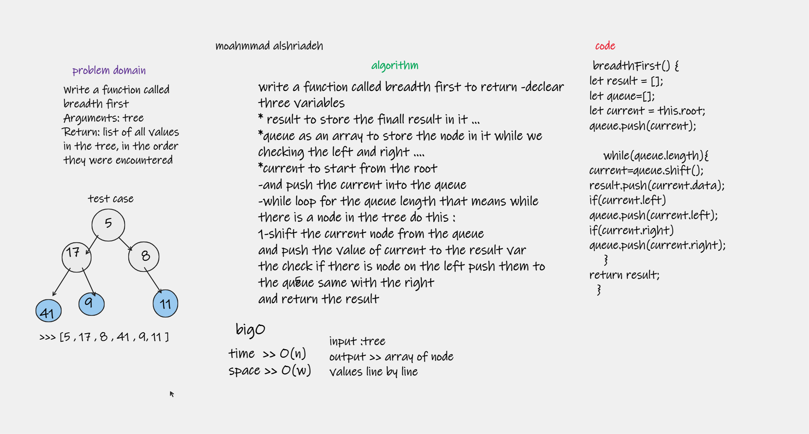

# Challenge Summary

Write a function called breadth first
Arguments: tree
Return: list of all values in the tree, in the order they were encountered

## Whiteboard Process

## Approach & Efficiency

while loop for sure
checking the right and the left
push the values

Big O for time = O(n)
Big O for Space = O(w) depend on widgth of the line 
## Solution

[code](./Breadth-first.js)

to run the code : `node Breadth-first.js`

to test the code " `npm test BFS`
